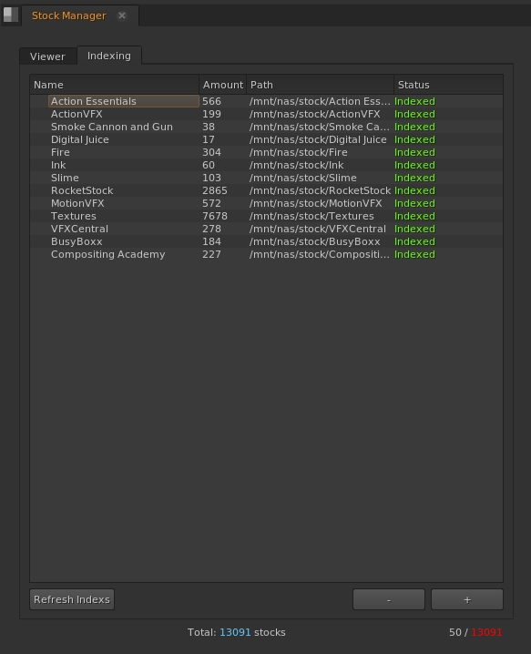
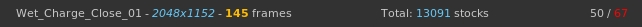
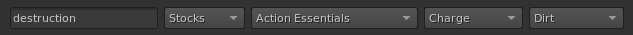
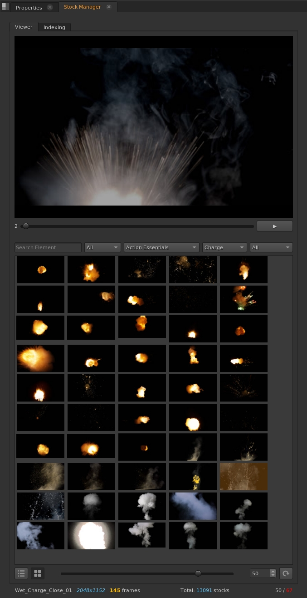
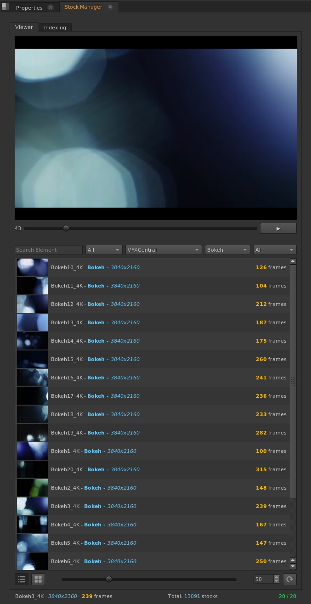

# Stock Manager
Stock manager for <b>Nuke</b> that indexes the stocks in a lighter version of jpg
to be able to visualize it and be able to quickly choose the correct stock
for the shot that requires it. and just it will support Nuke with Python 3,
not to dirty the code,

# Feautres
- <b>Quick</b> display of any video or texture in stock
- <b>Automatic labeling</b> using the name of the file or its folder
- <b>Fast search</b>, since the indexing remains in memory
- Various forms of <b>display and loading</b>

# Installation
1 - Copy to nuke folder
```sh
# Linux:
git clone --recursive https://github.com/fcocc77/stock_manager.git "~/.nuke/stock_manager"

# Windows
git clone --recursive https://github.com/fcocc77/stock_manager.git "C:\Users\<username>\.nuke\stock_manager"

# Or manually copy the entire git downloaded folder and its submodules to the nuke user folder
```

2 - Copy this line to <b>menu.py</b>
```python
import stock_manager
```

3 - Dependencies ( <b>FFMPEG</b> )
- Linux
```sh
# Any redhat distribution clone, for others look for ffmpeg installation method
sudo dnf -y install ffmpeg
```
- Windows

Download ffmpeg manually and copy it to loose stock manager folder as
<a href="https://ffmpeg.org/download.html#build-windows" target="_blank">ffmpeg.exe</a>
"C:\Users\username\\.nuke\stock_manager"


# Screenshots

- <b>INDEXING</b>

<p align="center">  </p>

- <b>STATUS BAR</b>

<p align="center">  </p>

- <b>DISPLAY OPCIONS</b>

<p align="center">  </p>

- <b>FILTER BAR</b>

<p align="center">  </p>

- <b>GRID</b> mode

<p align="center">  </p>

- <b>LIST</b> mode

<p align="center">  </p>

